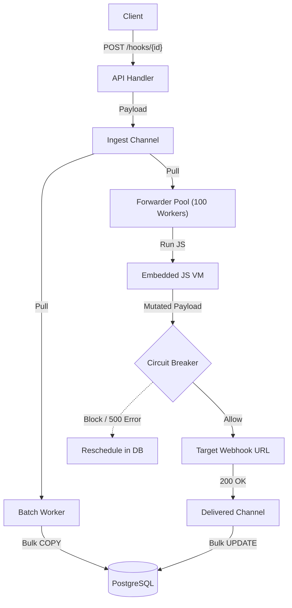

# 🦅 Vahak

Vahak is a high-performance webhook delivery engine written in Go. It handles reliable ingestion, JavaScript payload transformation, and outgoing delivery with a PostgreSQL backing store. 

Designed for high concurrency and resilience on a **single node**, Vahak utilizes channel-based batching, a bounded worker pool, and circuit breakers to achieve **3,500+ RPS** (Requests Per Second) on standard hardware. By intentionally avoiding distributed systems complexity (like Redis or RabbitMQ), Vahak prioritizes extreme ease of testing, local development, and one-click deployment.

It is built to be brutally simple and eliminate operational complexity:
- 📦 **Single Static Binary:** No massive dependency trees, Python environments, or Node.js installations.
- 🐘 **Zero Message Brokers:** Achieves asynchronous, high-throughput delivery exclusively using Go Channels (in-memory fast path) and PostgreSQL `COPY` batching (persistence). No Redis or RabbitMQ required.
- 🧬 **Embedded JS Engine:** Payload transformation is executed via an embedded JS VM (`goja`) running directly inside the Go process. No external Lambda functions required.

## 🏗️ Architecture

Vahak decouples ingestion from delivery to ensure high throughput and backpressure handling.



- 📥 **Fast-Path Ingestion:** Incoming webhooks are pushed into a bounded Go channel (`10,000` capacity) to absorb spikes and apply backpressure to clients.
- 💾 **Bulk Database Writing:** A background `BatchWorker` uses PostgreSQL's native `COPY` protocol to bulk-insert webhooks, eliminating single-insert transactional overhead.
- ⚡ **Bounded Delivery Pool:** A fixed pool of 100 goroutines handles outbound HTTP delivery.
- 🧹 **Batch Status Flusher:** Successful deliveries are flushed to PostgreSQL in bulk (`UPDATE ... WHERE id IN (...)`), significantly reducing table lock contention.
- 🔄 **DB Sweeper:** A background ticker sweeps the database for pending or failed jobs to ensure at-least-once delivery for jobs that bypassed the in-memory fast path.

## 🛡️ Security & Resilience Features

- 🚫 **SSRF Protection:** A custom HTTP `Transport` strictly blocks outbound connections to private subnets (`10.0.0.0/8`), loopback (`127.0.0.1`), and unspecified IPs.
- ⏱️ **Infinite Loop DoS Prevention:** JS payload transformations are strictly bounded by a 50ms `time.AfterFunc` interrupt to prevent malicious `while(true)` scripts from starving the worker pool.
- 🧠 **Memory Exhaustion (OOM) Limits:** Incoming webhook bodies are capped via `http.MaxBytesReader` (100KB limit).
- 🔌 **Circuit Breaker with Exponential Backoff:** Targets are tracked per-URL. If an endpoint fails 5 consecutive times, the circuit opens. The cooldown scales exponentially (30s, 60s, 120s, up to 5 minutes) before allowing a single probe request.
- 🌐 **HTTP Connection Pooling:** Aggressive reuse of TCP sockets (`MaxIdleConns: 100`) minimizes TCP handshake overhead on high-frequency targets.
- ⏱️ **TTL Cache Invalidation:** Target URLs and scripts are cached in-memory with a 60-second TTL to avoid database reads on the fast path.

## 📊 Benchmarks

Because Vahak is designed to max out a single machine, these benchmarks were run locally using `hey` within a Linux Docker environment (to bypass Windows TCP proxy bottlenecks):

- **Ingestion & Delivery:** 3,500 Requests Per Second (**300 million webhooks/day** on a single node)
- **Payload:** 22 bytes (`{"event": "load.test"}`)
- **Concurrency:** 500 simultaneous connections
- **Database Limits:** PostgreSQL tuned with `max_connections=250`.

**To reproduce the benchmark yourself:**
```bash
# 1. Start Vahak with the test sink
docker compose -f docker-compose.yml -f docker-compose.test.yml up --build -d

# 2. Create a test endpoint
curl -X POST -H "Content-Type: application/json" \
  -H "X-API-Key: docker_test_key" \
  -d '{"name": "Bench", "target_url": "http://sink:9090"}' \
  http://localhost:8080/api/endpoints

# 3. Run hey INSIDE the Docker network (replace <UUID> with the returned ID)
docker run --rm --network vahak_default williamyeh/hey \
  -n 15000 -c 500 -m POST \
  -d '{"event": "load.test"}' \
  -T "application/json" \
  "http://vahak:8080/hooks/<UUID>"
```
> ⚠️ Running `hey` directly from Windows will hit the Docker Desktop TCP proxy bottleneck and produce ~700 RPS. Always benchmark from inside the Docker network.

## ⚙️ Environment Variables

Vahak is configured via standard environment variables:

| Variable | Description | Default |
|----------|-------------|---------|
| `PORT` | The port the HTTP API listens on. | `8080` |
| `DB_URL` | PostgreSQL connection string. | (Required) |
| `DB_POOL_URL` | Used for `pgxpool` connections. | (Required) |
| `API_KEY` | Secret key for authenticating `/api/*` endpoints. | (Required) |

## 🚀 Getting Started

1. **Set up environment variables:**
   ```bash
   cp .env.example .env
   ```

2. **Start the production stack** (Vahak & PostgreSQL):
   ```bash
   docker compose up -d
   ```
   *(Optional)* To run the dummy Sink server for benchmarking, attach the test compose file:
   ```bash
   docker compose -f docker-compose.yml -f docker-compose.test.yml up --build -d
   ```

### ☁️ Connecting to a Cloud Database (NeonDB, RDS)

Vahak works seamlessly with managed cloud databases. Since Docker containers have automatic outbound internet access, Vahak can connect directly to your remote database using the URL you provide in your `.env` file.

**Important:** If you use a cloud database, you no longer need the local PostgreSQL container. To deploy properly:
1. Open `docker-compose.yml`.
2. Delete the entire `db:` service block.
3. Delete the `depends_on: db` block from the `vahak` service (otherwise Docker will refuse to start Vahak since it's waiting for the local DB).
4. Run `docker compose up -d` to spin up just the Vahak engine!

2. **Register an Endpoint:**
   ```bash
   curl -X POST -H "Content-Type: application/json" \
     -H "X-API-Key: docker_test_key" \
     -d '{"name": "Test", "target_url": "http://sink:9090"}' \
     http://localhost:8080/api/endpoints
   ```

3. **Fire a Webhook:**
   ```bash
   # Replace <UUID> with the ID returned from the previous command
   curl -X POST -H "Content-Type: application/json" \
     -d '{"msg": "hello"}' \
     http://localhost:8080/hooks/<UUID>
   ```

## 🧪 Testing

The codebase includes an automated test suite verifying the circuit breaker state machine, JS execution timeouts, and API routing.

Run the test suite with data race detection:
```bash
go test -v -race ./...
```

*Note: Integration tests in `handler_test.go` require a running PostgreSQL database on `127.0.0.1:5432` with a `vahak` user. They will gracefully `SKIP` if the database is unavailable.*

## 🛠️ Development

- **Language:** Go 1.26+
- **Database:** PostgreSQL 16
- **Routing:** `go-chi/chi`
- **JS Runtime:** `dop251/goja`
- **Driver:** `jackc/pgx/v5`

## 📜 License

This project is licensed under the MIT License - see the [LICENSE](LICENSE.txt) file for details.

## 🤝 Contributing

**Maintainer** : Swastik Bose (VasuBhakt)

## 🤓 Fun Fact

The inspiration for the name of this project comes from the Sanskrit word **_vahak_**, which means Messenger or Carrier.